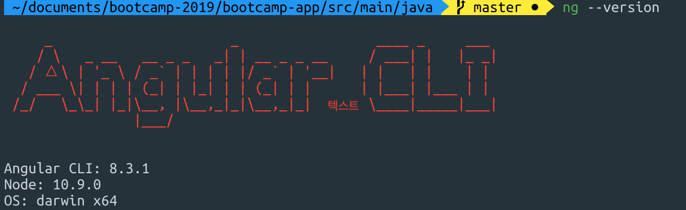
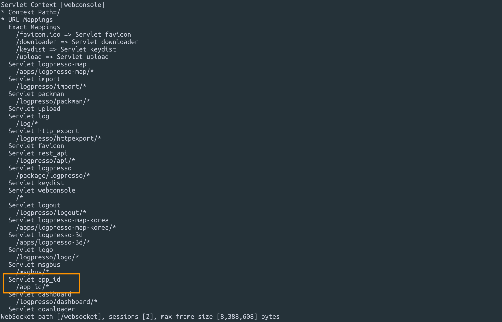
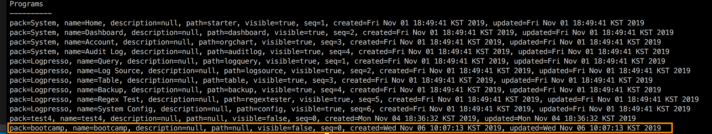
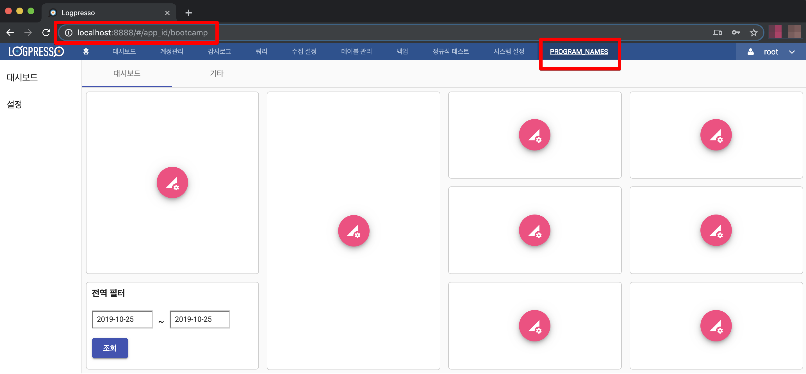
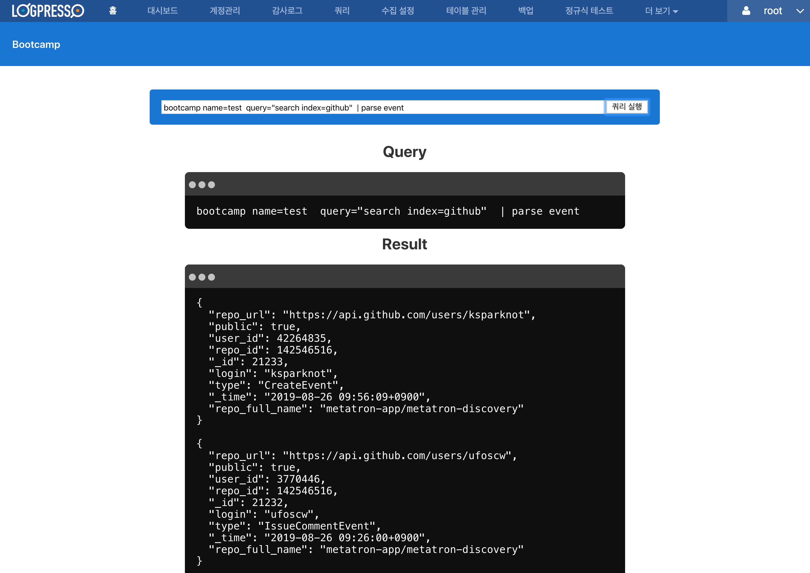

# bootcamp-2019

## step 0. parser setting

1. issue3597 branch full build
2. issue3597 cache extract
3. yarn install
4. run.sh
5. export JAVA_HOME=`/usr/libexec/java_home -v 9`
6. ./run.sh
7. telnet localhost 7001
8. bundle.install com.google.code.gson gson 2.8.6
9. bundle.install commons-cli commons-cli 1.4
10. bundle.install file:///Users/mac/Documents/splunk-sdk-java-1.6.5.jar
11. bundle.refresh
12. bundle.start 000 000 000
13. pom.xml
	<details>
	<summary>pom.xml</summary>
	<div markdown="1">

	```
	<project
		xsi:schemaLocation="http://maven.apache.org/POM/4.0.0 http://maven.apache.org/xsd/maven-4.0.0.xsd"
		xmlns="http://maven.apache.org/POM/4.0.0" xmlns:xsi="http://www.w3.org/2001/XMLSchema-instance">
		<modelVersion>4.0.0</modelVersion>
		<groupId>com.logpresso</groupId>
		<artifactId>bootcamp-app</artifactId>
		<version>1.0.0</version>
		<packaging>bundle</packaging>
		<name>Bootcamp App</name>
		<build>
			<plugins>
				<plugin>
					<groupId>org.apache.maven.plugins</groupId>
					<artifactId>maven-compiler-plugin</artifactId>
					<version>3.3</version>
					<configuration>
						<encoding>UTF-8</encoding>
						<source>8</source>
						<target>8</target>
						<debug>true</debug>
						<optimize>true</optimize>
						<showDeprecations>true</showDeprecations>
					</configuration>
				</plugin>
				<plugin>
					<groupId>org.apache.felix</groupId>
					<artifactId>maven-bundle-plugin</artifactId>
					<version>4.1.0</version>
					<extensions>true</extensions>
					<configuration>
						<instructions>
							<Bundle-SymbolicName>com.logpresso.bootcamp</Bundle-SymbolicName>						
							<Export-Package>
								com.logpresso.bootcamp.app,
								com.logpresso.bootcamp.msgbus
							</Export-Package>
							<Import-Package>
								*
							</Import-Package>
							<Private-Package>
								com.logpresso.bootcamp.command,
								com.logpresso.bootcamp.logger,
								com.logpresso.bootcamp.model,
								com.logpresso.bootcamp.parser,
								com.logpresso.bootcamp.script
							</Private-Package>
						</instructions>
					</configuration>
				</plugin>
				<plugin>
					<groupId>org.apache.felix</groupId>
					<artifactId>maven-ipojo-plugin</artifactId>
					<version>1.12.1</version>
					<executions>
						<execution>
							<goals>
								<goal>ipojo-bundle</goal>
							</goals>
						</execution>
					</executions>
				</plugin>
				<plugin>
					<groupId>com.github.eirslett</groupId>
					<artifactId>frontend-maven-plugin</artifactId>
					<version>1.6</version>
					<configuration>
						<workingDirectory>src/main/bootcamp</workingDirectory>
					</configuration>
					<executions>
						<execution>
							<id>install node and yarn</id>
							<goals>
								<goal>install-node-and-yarn</goal>
							</goals>
							<phase>pre-clean</phase>
							<configuration>
								<nodeVersion>v11.7.0</nodeVersion>
								<yarnVersion>v1.13.0</yarnVersion>
								<downloadRoot>http://staging.araqne.org/nodejs/dist/</downloadRoot>
							</configuration>
						</execution>
						<execution>
							<id>yarn install</id>
							<goals>
								<goal>yarn</goal>
							</goals>
							<configuration>
								<arguments>install --no-optional</arguments>
							</configuration>
						</execution>	
						<execution>
							<id>install dependencies</id>
							<goals>
								<goal>yarn</goal>
							</goals>
							<configuration>
								<arguments>install --ignore-optional --strict-ssl=false --ignore-scripts</arguments>
							</configuration>
						</execution>
						<execution>
							<id>build all</id>
							<goals>
								<goal>yarn</goal>
							</goals>
							<phase>generate-resources</phase>
							<configuration>
								<arguments>run build</arguments>
							</configuration>
						</execution>
					</executions>
				</plugin>
			</plugins>
		</build>
		<repositories>
			<repository>
				<id>splunk-artifactory</id>
				<name>Splunk Releases</name>
				<url>http://splunk.jfrog.io/splunk/ext-releases-local</url>
			</repository>
		</repositories>
		<dependencies>
			<dependency>
				<groupId>org.apache.felix</groupId>
				<artifactId>org.apache.felix.ipojo</artifactId>
				<version>1.10.1</version>
			</dependency>
			<dependency>
				<groupId>org.apache.felix</groupId>
				<artifactId>org.apache.felix.ipojo.annotations</artifactId>
				<version>1.10.1</version>
			</dependency>
			<dependency>
				<groupId>org.slf4j</groupId>
				<artifactId>slf4j-api</artifactId>
				<version>1.7.12</version>
			</dependency>
			<dependency>
				<groupId>org.slf4j</groupId>
				<artifactId>slf4j-simple</artifactId>
				<scope>test</scope>
				<version>1.7.12</version>
			</dependency>
			<dependency>
				<groupId>org.araqne</groupId>
				<artifactId>araqne-log-api</artifactId>
				<version>3.12.7</version>
			</dependency>
			<dependency>
				<groupId>org.araqne</groupId>
				<artifactId>araqne-logdb</artifactId>
				<version>3.9.1-1</version>
			</dependency>
			<dependency>
				<groupId>org.araqne</groupId>
				<artifactId>araqne-confdb</artifactId>
				<version>1.0.2</version>
			</dependency>
			<dependency>
				<groupId>com.splunk</groupId>
				<artifactId>splunk</artifactId>
				<version>1.6.5.0</version>
			</dependency>
			<dependency>
				<groupId>org.araqne</groupId>
				<artifactId>araqne-httpd</artifactId>
				<version>1.6.4</version>
			</dependency>
			<dependency>
				<groupId>org.araqne</groupId>
				<artifactId>araqne-msgbus</artifactId>
				<version>1.12.4</version>
			</dependency>		
			<dependency>
				<groupId>org.araqne</groupId>
				<artifactId>araqne-webconsole</artifactId>
				<version>3.18.1-1</version>
			</dependency>
			<dependency>
				<groupId>org.araqne</groupId>
				<artifactId>araqne-dom</artifactId>
				<version>3.5.4-2</version>
			</dependency>
		</dependencies>
	</project>
	```
	</div>
	</details>

14. 루트 폴더에 splunk-sdk-java-1.6.5.jar 넣기.
15. mvn install:install-file -DgroupId=com.splunk -DartifactId=splunk -Dversion=1.6.5.0 -Dpackaging=jar -Dfile=splunk-sdk-java-1.6.5.jar
16. bootcamp/src/main 에 java 폴더채 넣기
17. /Users/mac/Documents/bootcamp-2019/bootcamp-app/src/main/resources/metadata.xml 붙여넣기
18. createSplunkProfile
	```
	bootcamp.createSplunkProfile
	name?
	test
	host?
	172.20.34.2
	port?
	8089
	user?
	logpresso
	password?
	logpresso
	```
19. 시스템 설정, 파서, 새 파서 만들기, 부트캠프, 스플렁크 깃헙 이벤트, 다음, event, 완료
20.	쿼리 테스트 bootcamp name=test  query="search index=github"  | parse event


## step 1 ~ step 11
- 애플리케이션 생성, 빌드
- 앱을 로그프레소에 추가
- 앵귤러 8.0
- 시나리오 기반 데이터 연동
- step1 ~ step11 git branch

	안녕하세요 프론트 개발파트 강의를 맡은 개발자 김형태 입니다. 이번 실습에서는 총 11단계에 걸쳐 앱을 생성하고 빌드해서 로그프레소에 추가해 보겠습니다.

	부트캠프 시나리오 기반 데이터를 연동해서 앱에서 보여주는 부분까지 진행하게 될 거구요.

	애플리케이션 개발에 사용할 앵귤러 프레임워크는 가장 최신 버전인 8.0 을 사용하겠습니다.

	중간에 하다가 막힌다거나 하시면 step1번부터 step11번까지 각각의 브랜치로 준비되어 있으니 필요하시면 체크아웃 하셔서 사용하시면 되겠습니다.
	
	그럼 먼저 터미널에서 로그프레소를 시작해 주겠습니다. telnet으로 7008번 포트로 접속해 줍니다.


## step 1. createAppProject

- logpresso.createAppProject
	```
	telnet localhost 7008
	Trying ::1...
	telnet: connect to address ::1: Connection refused
	Trying 127.0.0.1...
	Connected to localhost.
	Escape character is '^]'.
	login as: root
	password:

	Please change the default password.
	New password:
	Retype password:
	Password changed successfully.

	Logpresso 3.9.1.1 (build 20191029) on Araqne Core 3.4.5
	``` 

	여기서 입력한 부분들은 다음 단계에서 살펴보겠습니다.

	```
	logpresso.createAppProject
	Project path? /Users/mac/Documents/bootcamp-2019/bootcamp-app
	Bundle Symbolic Name? com.logpresso.bootcamp
	Bundle Version? 1.0
	App ID? bootcamp
	App Name? bootcamp
	App Version? 1.0
	Required Version (empty line to default version 3.0)?4.0
	Program ID (empty line to exit)? bootcamp
	Program Display Name? bootcamp
	Program Profiles? all,admin,member
	Program ID (empty line to exit)?
	```

## 2. manifest.json
- manifest.json

	스텝1에서 앱을 생성하면 manifest.json 파일이 생성되었을 것입니다. 파일을 한번 열어볼까요

	이 파일은, 앞에서 우리가 생상한 앱이 실행될 때의 시작 파라미터와 기본값을 담고 있는데요

	이 메타데이터를 json 기반으로 작성해 줍니다. 이를 통해 앱의 이름, 시작할때 열리게 되는 페이지 등을 지정할 수 있습니다. 
	
	이 프로젝트에서는 다음과 같은 위치에 넣어줍니다. 

	>`/bootcamp-2019/bootcamp-app/src/main/resources/manifest.json`

	```
	{
		"required_version": "4.0",
		"app_version": "1.0.0",
		"bundle_symbolic_name": "com.logpresso.bootcamp",
		"app_names": {
			"ko": "bootcamp",
			"en": "bootcamp"
		},
		"programs": [
			{
				"program_names": {       
					"ko": "program_names", 
					"en": "program_names"
				},
				"program_id": "bootcamp", 
				"program_profiles": [
					"all",
					"admin",
					"member"
				]
			}
		],
		"app_id": "app_id", 
		"bundle_version": "1.0.0"
	}
	```
	예제 내용은 경로설정 하는 방법을 알려드리려고 현재 열린 파일과는 조금 다르게 설정 해봤는데요 여기서

	`"program_names"` 은 로그프레소 대메뉴에 추가되는 메뉴 이름 부분이구요

	`"program_id"` 는 나중에 생성될 angular.json의  outputPath 폴더명과 일치시켜 줘야 합니다.

	`"app_id"` 는 서블렛에서 URL 맵핑되는 부분이 되겠습니다. 


## 3. Angular-cli 로 프로젝트 생성

- Angular-cli

	앵귤러 cli는 프로젝트 생성부터 템플릿 자동생성, 개발 서버, 배포, 테스트 등을 지원합니다. 
	
	이렇게 다양한 기능을 제공하기 때문에 앵귤러 프로젝트를 진행하는데는 필수 개발도구입니다.

	그럼 바로 설치해 보겠습니다. 터미널을 열고 다음 명령어를 입력합니다. 

	```
	yarn global add @angular/cli
	```
	```
	? Would you like to add Angular routing? Yes
	? Which stylesheet format would you like to use? Less
	```
- ng 명령어

	설치가 완료되면 이제 ng 명령어를 사용할 수 있는데요 그럼 한번 명령어로 설치된 앵귤러 버전을 확인해 보겠습니다. 현재 버전은 앵귤러8.3.1 버전이네요.
	```
	ng --version
	```

	

- ng new

	앵귤러 cli의 프로젝트 생성 명령은 `ng new` 입니다. 이를 이용해 프로젝트를 생성해 보겠습니다. 이 경로로 들어가셔서 ng new bootcamp
	>`/bootcamp-2019/bootcamp-app/src/main/`
	```
	ng new bootcamp
	```

## 4. outputPath, base href 경로 수정
- outputPath

	이번에는 angular.json파일을 열고 outputPath를 수정해 주겠습니다.
	앵귤러 프로젝트의 빌드 결과가 저장되는 폴더입니다. 이 폴더명이 스텝 2에서 지정한 program_id 로 인식됩니다.
	>`/bootcamp-2019/bootcamp-app/src/main/bootcamp/angular.json`
	```
	"outputPath": "../resources/WEB-INF/bootcamp",
	```

	이 경로로 들어가셔서 index.html 을 수정하겠습니다. 로그프레소에서 인식하는 html 루트 경로를 맞춰줍니다.
- base href	
	>`/bootcamp-2019/bootcamp-app/src/main/bootcamp/src/index.html`
	```
	<base href="./">
	```


## 5. 빌드, 로그프레소 대메뉴에 추가하기
- ng build

	이제 앞에서 생성한 앵귤러 프로젝트로 생성한 앱을 로그프레소 대메뉴에 추가해 보겠습니다.
	
	앵귤러 프로젝트를 빌드해주는 명령어 ng build를 실행해 줍니다.
	>`/bootcamp-2019/bootcamp-app/src/main/bootcamp/`
	```
	ng build
	```

- buildApp

	생성한 앵귤러 프로젝트를 빌드하여 번들 jar파일로 만들어 주겠습니다.

	그리고 빌드 후 생성된 번들 jar 파일을 install 해주고 refresh 후에 start 해 줍니다.

	빌드앱을 해주면 로그프레소에 앱이 등록이 되기 때문에 이후에는 

	```
	logpresso.buildApp /Users/mac/Documents/bootcamp-2019/bootcamp-app /Users/mac/Documents/bootcamp-2019/bootcamp-app/bootcamp-app-1.0.0.jar
	bundle.install file:///Users/mac/Documents/bootcamp-2019/bootcamp-app/bootcamp-app-1.0.0.jar
	bundle.refresh
	bundle.start 113
	```

- 맵핑된 URL

	한번 서블릿에 맵핑된 URL을 확인해 보겠습니다. 아래 명령어를 입력하시면 확인이 가능하구요. 이미지는 제가 아까 예제로 스텝2에서 지정한 app_id 부분 입니다.
	```
	httpd.contexts
	```
	

- 등록된 프로그램

	스텝2에서 지정한 program_id 는 dom.programs localhost 라고 입력하시면 됩니다.
	```
	dom.programs localhost
	```
	

- 메뉴에 추가된 앱 확인.

	이제 브라우저를 열고 `localhost:8888` 주소를 입력해 보겠습니다. 

	여기까지 잘 진행되었다면 대메뉴 가장 오른쪽에 방금 만든 앱이 추가가 되었을 된 것을 확인할 수 있을 것입니다.

	현재 URL을 보시면 앞서 step2의 manifest.json에서 설정한 app_id/program_id 를 확인할 수 있습니다.
	```
	localhost:8888
	```
	

## 6. eediom-sdk, material-cdk

- eediom-sdk

	이제부터는 이번 부트캠프의 시나리오 기반 데이터를 연동하기 위해 필요한 세팅입니다.

	>`/bootcamp-2019/bootcamp-app/src/main/bootcamp/`

	```
	$ yarn add https://github.com/logpresso/eediom-sdk.git#v1.0.5
	```
 
- material-cdk

	>`/bootcamp-2019/bootcamp-app/src/main/bootcamp/`

	```
	$ ng add @angular/material
	```
	```
	? Choose a prebuilt theme name, or "custom" for a custom theme: Indigo/Pink    // 테마 색상 선택
	? Set up HammerJS for gesture recognition?                                     // 제스처 라이브러리
	? Set up browser animations for Angular Material?                              // material 애니메이션 추가
	```


## 7. tsconfig.json, package.json

- tsconfig.json

	여기서는 타입스크립트가 컴파일 되어질 ecma스크립트 버전을 수정해 주겠습니다. target과 lib를 수정합니다.
	>`/bootcamp-2019/bootcamp-app/src/main/bootcamp/tsconfig.json`

	```
	{
		"compileOnSave": false,
		"compilerOptions": {
			"baseUrl": "./",
			"outDir": "./dist/out-tsc",
			"sourceMap": true,
			"declaration": false,
			"downlevelIteration": true,
			"experimentalDecorators": true,
			"module": "esnext",
			"moduleResolution": "node",
			"importHelpers": true,
			"target": "es5",
			"typeRoots": [
			"node_modules/@types"
			],
			"lib": [
			"es2015",
			"es2016",
			"es2017",
			"es2018",
			"dom"
			]
		},
		"angularCompilerOptions": {
			"preserveWhitespaces": true,
			"fullTemplateTypeCheck": true,
			"strictInjectionParameters": true
		}
	}
	```

- package.json

	bin과 ,script 부분을 수정해 줍니다.

	>`/bootcamp-2019/bootcamp-app/src/main/bootcamp/package.json`

	```
	{
		"name": "test4",
		"version": "0.0.0",
		"bin": {
			"node": "node/node",
			"yarn": "node/yarn/dist/bin/yarn",
			"ng": "node/node node_modules/@angular/cli/bin/ng"
		},
		"scripts": {
			"ng": "ng",
			"start": "ng serve --base-href=/ --open",
			"build": "ng build --output-hashing=none --prod --build-optimizer=false",
			"test": "ng test",
			"lint": "ng lint",
			"e2e": "ng e2e"
		},
		"private": true,
		"dependencies": {
			"@angular/animations": "~8.2.11",
			"@angular/cdk": "~8.2.3",
			"@angular/common": "~8.2.11",
			"@angular/compiler": "~8.2.11",
			"@angular/core": "~8.2.11",
			"@angular/forms": "~8.2.11",
			"@angular/material": "^8.2.3",
			"@angular/platform-browser": "~8.2.11",
			"@angular/platform-browser-dynamic": "~8.2.11",
			"@angular/router": "~8.2.11",
			"eediom-sdk": "https://github.com/logpresso/eediom-sdk.git#v1.0.5",
			"hammerjs": "^2.0.8",
			"rxjs": "~6.4.0",
			"tslib": "^1.10.0",
			"zone.js": "~0.9.1"
		},
		"devDependencies": {
			"@angular-devkit/build-angular": "~0.803.14",
			"@angular/cli": "~8.3.14",
			"@angular/compiler-cli": "~8.2.11",
			"@angular/language-service": "~8.2.11",
			"@types/jasmine": "~3.3.8",
			"@types/jasminewd2": "~2.0.3",
			"@types/node": "~8.9.4",
			"codelyzer": "^5.0.0",
			"jasmine-core": "~3.4.0",
			"jasmine-spec-reporter": "~4.2.1",
			"karma": "~4.1.0",
			"karma-chrome-launcher": "~2.2.0",
			"karma-coverage-istanbul-reporter": "~2.0.1",
			"karma-jasmine": "~2.0.1",
			"karma-jasmine-html-reporter": "^1.4.0",
			"protractor": "~5.4.0",
			"ts-node": "~7.0.0",
			"tslint": "~5.15.0",
			"typescript": "~3.5.3"
		}
	}
	```

## 8. app.module.ts, app.component.ts

- app.module.ts

	>`/bootcamp-2019/bootcamp-app/src/main/bootcamp/src/app/app.module.ts`

	```
	import { BrowserModule } from '@angular/platform-browser';
	import { NgModule } from '@angular/core';
	import { AppRoutingModule } from './app-routing.module';
	import { AppComponent } from './app.component';
	import { BrowserAnimationsModule } from '@angular/platform-browser/animations';
	import { ServiceModule, QueryService } from 'eediom-sdk';
	import { FormsModule } from '@angular/forms';
	@NgModule({
		declarations: [
			AppComponent
		],
		imports: [
			BrowserModule,
			AppRoutingModule,
			BrowserAnimationsModule,
			ServiceModule.forRoot({
				productName: 'Araqne'
			}),
			FormsModule
		],
		providers: [QueryService],
		bootstrap: [AppComponent]
	})
	export class AppModule { }
	```


- app.component.ts

	>`/bootcamp-2019/bootcamp-app/src/main/bootcamp/src/app/app.component.ts`

	```
	import { Component } from '@angular/core';
	import { QueryService } from 'eediom-sdk';
	@Component({
	selector: 'app-root',
	templateUrl: './app.component.html',
	styleUrls: ['./app.component.less']
	})
	export class AppComponent {
		title = 'test4';
		query:string = '';
		result:any = [];
		runQuery:boolean = false;

		constructor(private queryService: QueryService) {
		}

		executeQuery() {
			this.queryService.query(this.query, 100, 0).then((res) => {
			this.result = res.records;
			this.runQuery = true;
			});
		}
	}
	```


## 9. app.component.html

- app.component.html

	>`/bootcamp-2019/bootcamp-app/src/main/bootcamp/src/app/app.component.ts`

	<details>
	<summary>app.component.html</summary>
	<div markdown="1">

	```
	<style>
		:host {
			font-family: -apple-system, BlinkMacSystemFont, "Segoe UI", Roboto, Helvetica, Arial, sans-serif, "Apple Color Emoji", "Segoe UI Emoji", "Segoe UI Symbol";
			font-size: 14px;
			color: #333;
			box-sizing: border-box;
			-webkit-font-smoothing: antialiased;
			-moz-osx-font-smoothing: grayscale;
		}

		h1,
		h2,
		h3,
		h4,
		h5,
		h6 {
			margin: 8px 0;
		}

		p {
			margin: 0;
		}


		.toolbar {
			height: 60px;
			display: flex;
			align-items: center;
			background-color: #1976d2;
			color: white;
			font-weight: 600;
		}

		.toolbar span {
			margin-left: 20px;
		}

		.toolbar img {
			margin: 0 16px;
		}


		.content {
			display: flex;
			margin: 32px auto;
			padding: 0 16px;
			max-width: 960px;
			flex-direction: column;
			align-items: center;
		}


		.card-container {
			display: flex;
			flex-wrap: wrap;
			justify-content: center;
			margin-top: 16px;
		}

		.card {
			border-radius: 4px;
			border: 1px solid #eee;
			background-color: #fafafa;
			height: 40px;
			width: 200px;
			margin: 0 8px 16px;
			padding: 16px;
			display: flex;
			flex-direction: row;
			justify-content: center;
			align-items: center;
			transition: all 0.2s ease-in-out;
			line-height: 24px;
		}

		.card-container .card:not(:last-child) {
			margin-right: 0;
		}

		.card.card-small {
			height: 16px;
			width: 168px;
		}

		.card-container .card:not(.highlight-card) {
			cursor: pointer;
		}

		.card-container .card:not(.highlight-card):hover {
			transform: translateY(-3px);
			box-shadow: 0 4px 17px rgba(black, 0.35);
		}

		.card-container .card:not(.highlight-card):hover .material-icons path {
			fill: rgb(105, 103, 103);
		}

		.card.highlight-card {
			background-color: #1976d2;
			color: white;
			font-weight: 600;
			border: none;
			width: auto;
			min-width: 30%;
			position: relative;
		}

		.card.card.highlight-card span {
			margin-left: 60px;
		}


		a,
		a:visited,
		a:hover {
			color: #1976d2;
			text-decoration: none;
		}

		a:hover {
			color: #125699;
		}

		.terminal {
			position: relative;
			width: 80%;
			max-width: 600px;
			border-radius: 6px;
			padding-top: 45px;
			margin-top: 8px;
			overflow: hidden;
			background-color: rgb(15, 15, 16);
		}

		.terminal::before {
			content: "\2022 \2022 \2022";
			position: absolute;
			top: 0;
			left: 0;
			height: 4px;
			background: rgb(58, 58, 58);
			color: #c2c3c4;
			width: 100%;
			font-size: 2rem;
			line-height: 0;
			padding: 14px 0;
			text-indent: 4px;
		}

		.terminal pre {
			font-family: SFMono-Regular,Consolas,Liberation Mono,Menlo,monospace;
			color: white;
			padding: 0 1rem 1rem;
			margin: 0;
		}
	</style>

	<div class="toolbar" role="banner">
		<span>Bootcamp</span>
	</div>

	<div class="content" role="main">
		<div class="card highlight-card card-small">

	<input style="width:600px;" type="text" [(ngModel)]="query">
	<button (click)="executeQuery()">쿼리 실행</button>
	</div>
		<h2>Query</h2>
		<div class="terminal">
			<pre>{{query}}</pre>
		</div>
		<h2 *ngIf="runQuery"> Result</h2>
		<div *ngIf="runQuery" class="terminal">
				<pre *ngFor="let item of result">{{item | json}}</pre>
		</div>
	</div>

	<router-outlet></router-outlet>
	```
	</div>
	</details>


- eediom-sdk 구버전 적용(eediom-sdk 수정전 임시사용)

	다운로드 폴더에 eediom-sdk 압축풀기.
	>`/bootcamp-2019/bootcamp-app/src/main/bootcamp/`

	```
	yes | cp -rf ../../../../../../Downloads/sdk ./node_modules/eediom-sdk
	```

- pom.xml 수정(eediom-sdk 수정전 임시사용)
	<details>
	<summary>pom.xml</summary>
	<div markdown="1">

	```
	<project
		xsi:schemaLocation="http://maven.apache.org/POM/4.0.0 http://maven.apache.org/xsd/maven-4.0.0.xsd"
		xmlns="http://maven.apache.org/POM/4.0.0" xmlns:xsi="http://www.w3.org/2001/XMLSchema-instance">
		<modelVersion>4.0.0</modelVersion>
		<groupId>com.logpresso</groupId>
		<artifactId>bootcamp-app</artifactId>
		<version>1.0.0</version>
		<packaging>bundle</packaging>
		<name>Bootcamp App</name>
		<build>
			<plugins>
				<plugin>
					<groupId>org.apache.maven.plugins</groupId>
					<artifactId>maven-compiler-plugin</artifactId>
					<version>3.3</version>
					<configuration>
						<encoding>UTF-8</encoding>
						<source>8</source>
						<target>8</target>
						<debug>true</debug>
						<optimize>true</optimize>
						<showDeprecations>true</showDeprecations>
					</configuration>
				</plugin>
				<plugin>
					<groupId>org.apache.felix</groupId>
					<artifactId>maven-bundle-plugin</artifactId>
					<version>4.1.0</version>
					<extensions>true</extensions>
					<configuration>
						<instructions>
							<Bundle-SymbolicName>com.logpresso.bootcamp</Bundle-SymbolicName>						
							<Export-Package>
								com.logpresso.bootcamp.app,
								com.logpresso.bootcamp.msgbus
							</Export-Package>
							<Import-Package>
								*
							</Import-Package>
							<Private-Package>
								com.logpresso.bootcamp.command,
								com.logpresso.bootcamp.logger,
								com.logpresso.bootcamp.model,
								com.logpresso.bootcamp.parser,
								com.logpresso.bootcamp.script
							</Private-Package>
						</instructions>
					</configuration>
				</plugin>
				<plugin>
					<groupId>org.apache.felix</groupId>
					<artifactId>maven-ipojo-plugin</artifactId>
					<version>1.12.1</version>
					<executions>
						<execution>
							<goals>
								<goal>ipojo-bundle</goal>
							</goals>
						</execution>
					</executions>
				</plugin>
				<plugin>
					<groupId>com.github.eirslett</groupId>
					<artifactId>frontend-maven-plugin</artifactId>
					<version>1.6</version>
					<configuration>
						<workingDirectory>src/main/bootcamp</workingDirectory>
					</configuration>
					<executions>
						<execution>
							<id>install node and yarn</id>
							<goals>
								<goal>install-node-and-yarn</goal>
							</goals>
							<phase>pre-clean</phase>
							<configuration>
								<nodeVersion>v11.7.0</nodeVersion>
								<yarnVersion>v1.13.0</yarnVersion>
								<downloadRoot>http://staging.araqne.org/nodejs/dist/</downloadRoot>
							</configuration>
						</execution>
						<execution>
							<id>build all</id>
							<goals>
								<goal>yarn</goal>
							</goals>
							<phase>generate-resources</phase>
							<configuration>
								<arguments>run build</arguments>
							</configuration>
						</execution>
					</executions>
				</plugin>
			</plugins>
		</build>
		<repositories>
			<repository>
				<id>splunk-artifactory</id>
				<name>Splunk Releases</name>
				<url>http://splunk.jfrog.io/splunk/ext-releases-local</url>
			</repository>
		</repositories>
		<dependencies>
			<dependency>
				<groupId>org.apache.felix</groupId>
				<artifactId>org.apache.felix.ipojo</artifactId>
				<version>1.10.1</version>
			</dependency>
			<dependency>
				<groupId>org.apache.felix</groupId>
				<artifactId>org.apache.felix.ipojo.annotations</artifactId>
				<version>1.10.1</version>
			</dependency>
			<dependency>
				<groupId>org.slf4j</groupId>
				<artifactId>slf4j-api</artifactId>
				<version>1.7.12</version>
			</dependency>
			<dependency>
				<groupId>org.slf4j</groupId>
				<artifactId>slf4j-simple</artifactId>
				<scope>test</scope>
				<version>1.7.12</version>
			</dependency>
			<dependency>
				<groupId>org.araqne</groupId>
				<artifactId>araqne-log-api</artifactId>
				<version>3.12.7</version>
			</dependency>
			<dependency>
				<groupId>org.araqne</groupId>
				<artifactId>araqne-logdb</artifactId>
				<version>3.9.1-1</version>
			</dependency>
			<dependency>
				<groupId>org.araqne</groupId>
				<artifactId>araqne-confdb</artifactId>
				<version>1.0.2</version>
			</dependency>
			<dependency>
				<groupId>com.splunk</groupId>
				<artifactId>splunk</artifactId>
				<version>1.6.5.0</version>
			</dependency>
			<dependency>
				<groupId>org.araqne</groupId>
				<artifactId>araqne-httpd</artifactId>
				<version>1.6.4</version>
			</dependency>
			<dependency>
				<groupId>org.araqne</groupId>
				<artifactId>araqne-msgbus</artifactId>
				<version>1.12.4</version>
			</dependency>		
			<dependency>
				<groupId>org.araqne</groupId>
				<artifactId>araqne-webconsole</artifactId>
				<version>3.18.1-1</version>
			</dependency>
			<dependency>
				<groupId>org.araqne</groupId>
				<artifactId>araqne-dom</artifactId>
				<version>3.5.4-2</version>
			</dependency>
		</dependencies>
	</project>
	```
	</div>
	</details>


## 10. 메이븐 빌드, 번들 교체

- mvn clean install, bundle.replace

	pom.xml 파일이 위차한 경로에서 빌드해 줍니다.

	빌드 후 생성된 번들을 replace 하고 refresh 해 줍니다.
	>`/bootcamp-2019/bootcamp-app/`

	```
	mvn clean install
	bundle.replace 113 file:///Users/mac/Documents/bootcamp-2019/bootcamp-app/target/bootcamp-app-1.0.0.jar
	bundle.refresh
	```


## 11. 시나리오 기반 데이터 연동

- parse event
	
	```
	localhost:8888
	```
	
	생성된 앱의 인풋 박스에 쿼리를 실행하고 결과를 출력한다.
	```
	bootcamp name=test  query="search index=github"  | parse event
	```
	
